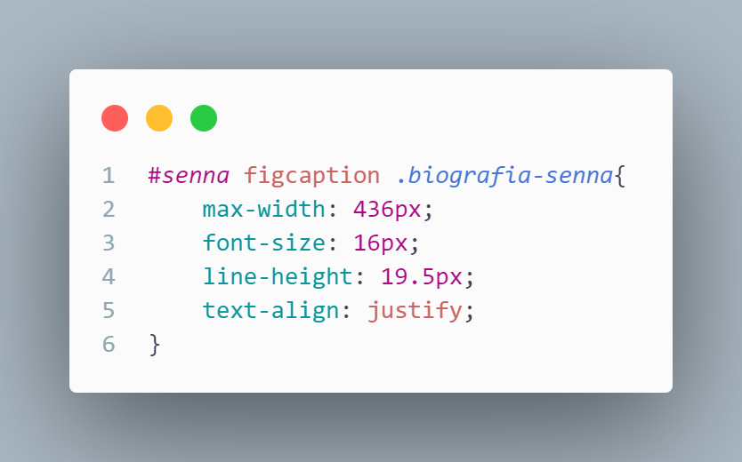
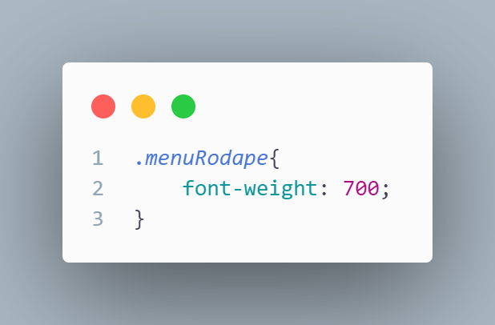

# _**Index.html**_

Aqui no head está guardando elementos importantes como, lang = "pt-br" (idioma que o site é) e configurações padrão do titulo do site, o link separado esta permitindo que eu consiga pegar frameworks do "BootStrap", esse ultimo conjunto de links são os caminhos para o css poder estilizar os conteúdos do HTML.

Esse conjunto inteiro de código é o que forma o cabeçalho do site onde fica armazenado a logo (que está sendo definida pela tag "A") os botoes do menu (que está agrupado por causa de uma lista nao ordena, a tag "UL") e o ícone do perfil do usuário (o ícone do perfil é do bootstrap).

Esse grupo de tag "IMG" é o que esta colocando as imagens do carrossel no site.

Aqui foi usado uma framework importada do bootstrap para definir linhas e colunas mais facilmente através de algumas "DIV" acompanhadas com class para definir a linha e a quantidade de colunas, dentro dessas "DIV" estão a tag "FIGURE" que coloca a imagem e a "FIGCAPTION" acompanhada do "P" que coloca a escrita.

Esse conjunto está criando uma imagem com um titulo e uma descrição que vai ser estilizado dentro do CSS para virar um card. Esse código se repete mais 2 vezes para criar um total de 3 cards no final.

Esse código está criando um formulário que através da tag "FORM" (essa tag que possibilita criar formulários no site) e "INPUT" o fieldset so esta agrupando todos esse elementos (mais por uma boa pratica para evitar erros)

Esta criando um rodapé para o site usando novamente a framework do bootstrap para criar 4 colunas dentro do rodapé, os elementos estão dentro de uma lista nao ordenada. E a tag 
"/BODY " esta fechando o corpo do site

Esse comando é o que esta dando um juntando o código do javascript com o html fazendo funcionar o carrossel.

---
## _**JAVASCRIPT**_

Esse código esta fazendo o carrossel do site funcionar a partir de uma função que se o indexSlide for menor ou igual ao totalSlides, o slide vai ficar passando em um intervalo de 5 segundos.

---
## _**STYLE.CSS**_

O primeiro import está me dando código para poder usar a fonte Inter, ja o segundo import está me possibilitando pegar ícones do bootstrap.

Esta deixando o site sem nenhuma margem, definindo que no site inteiro a fonte padrão vai ser a Inter e a intensidade da cor da letra em 600.

Esta deixando o header e o nav flexível, alinhando os itens ao centro da tela, e a tag "JUSTIFY-CONTENT" está colocando um espaçamento entre os elementos do nav.

Está deixando a fonte sem o sublinhado que fica embaixo da letra, mudando a cor da fonte para #070049, deixando a cor intensidade da cor em 900 e adicionando um comando que ao passar o mouse em cima ele vira um elemento clicável.

Esta mudando o tamanho do ícone do perfil para 23px.

esta deixando o texto sem os elementos de lista que vao na frente, tornando o menu e o avatar flexíveis e colocando um espaçamento de 8px de cada elemento.

Está deixando o texto sem nenhum sublinhado embaixo das escritas, mudando a cor da fonte para #070049, colocando uma borda em volta de cada elemento com 8px e adicionando uma borda arredondada de 8px.

Esses códigos eu tirei do DevTools enquanto eu estava tentando corrigir um erro na hora de alinhar os elementos do cabeçalho, coloquei os valores do primeiro e do segundo código em 0, isso resolveu o problema que tinha acontecido.

Esse condigo esta mudando a cor de letra do menu do cabeçalho e do ícone do perfil do usuário ao passar o mouse em cima.

---
## ***CARROSSEL.CSS***

Esta deixando a seção inteira do banner flexível, alinhando todas as imagens no centro e colocando um espaçamento de 10px do conteúdo abaixo do carrossel.

Esta deixando a imagem com 100% do tamanho disponível

esta colocando o container do carrossel para ocupar 100% do espaço e a tag "MAX-WIDTH" está criando um limite de 1920px que a imagem pode ocupar, colocou uma borda de 2px na cor de #C9C9C9 e arredondando as bordas em 10px, a tag "OVERFLOW: HIDDEN" está fazendo que todas as outras imagens que ultrapassem esse limite fiquem escondidas e o "POSITION: RELATIVE" está deixando as imagens em so uma direção.

Está deixando a class "carrossel" flexível e a tag "transition: transform" faz que quando troque a imagem faça uma animação passando a imagem.

---
## ***SENNA.CSS***

Está deixando todo o "figure" flexível, as tags "align-itens: center, justify-content: center" estão alinhando os elementos ao centro da tela e a tag "flex-direction: row" está fazendo que todos os elementos fique apenas na direção de uma linha.

Está deixando a imagem com uma altura de 676px e a largura de 100% com a tag "max-width: 461px" limitando a largura em 461px e tag "object-fit: cover" faz que quando a imagem diminua de tamanho ela nao perca suas proporções.

A tag "font-size" está mudando o tamanho da fonte para 48px, "font-weight" está mudando a intensidade da cor da fonte para 700, "text-align" está fazendo que o titulo fique ao lado esquerdo, e o "height" está deixando com uma altura de 60px.

O "max-width" faz com que o texto nao ultrapasse a largura de 436px, "font-size" está deixando a fonte com o tamanho de 16px,
"line-height" faz com que a altura da linha seja 19.5px e o "text-align: justify" faz que o ocupe todo o espaço da linha.

---
## ***MODELOS.CSS***

Está mudando a cor do fundo do figure e colocando um padding de 15px em cima e embaixo, "width" está deixando o tamanho do figure em 100% e limitando o tamanho máximo em 250px, "height" está o tamanho em 368px de altura, "border-radius" está arredondando as bordas do figure em 24px e alinhando o texto no meio.

Está deixando a altura e a largura em 100% do espaço disponível, "max-width e max-height" estão limitando o espaço disponível em 200px, "border-radius" está arredondando a borda em 15px e o "object-fit" está mantendo as proporções da imagem.

Está colocando um padding de 5px de cada lado, tirando a margem de baixo da imagem, "font-size" está alterando o tamanho da fonte para 18px, "font-weight" está colocando a intensidade da cor da fonte em 800 e "height" está deixando o tamanho em 40.

O "text-align: justify" está fazendo que a escrita preencha toda a linha, esse conjunto de tags "webkit-box overflow e text-overflow" está escondendo o restante do texto que passou de 3 linhas.

Esta mudando o tamanho da fonte para 15 e colocando o tamanho da linha em 1.4.

Esta colocando um espaçamento de cada lado da descrição do modelo

Está deixando flexível, alinhando os itens ao centro e colocando um espaçamento entre os cards, o "margin-top" está colocando um espaçamento entre a seção de cima de 40px.

---
## ***MAPAFORMULARIO.CSS***

O "margin-top" está dando um espaçamento de 40px da seção de cima, "display: flex" está deixando o container flexível, as tags "align-itens: center e justify-content:center" estão deixando o formulário e o mapa alinhados ao centro da tela e o "gap" está dando um espaçamento de 150px entre o mapa e o formulário.

Esta deixando o tamanho da fonte em 32px e a intensidade da cor da fonte em 600px "margin-bottom" está deixando um espaço de 8px entre o formulário.

Esse conjunto inteiro de código está mudando o altura e a largura dos campos do formulário, tirando as bordas pretas que vem junto com o campo e alterando a cor de fundo, arredondando as bordas em 10px e dando um espaçamento de 5px entre eles.

---
## ***FOOTER.CSS***

Esta mudando a cor do footer para #D9D9D9, dando um espaço de 50px da seção de cima, e colocando um padding de 10px em cima e 20px embaixo.

Esta tirando os pontos da lista dos elementos do footer, deixando as listas flexíveis e alinhando elas no centro.

Esta mudando a intensidade da cor da fonte para 700.