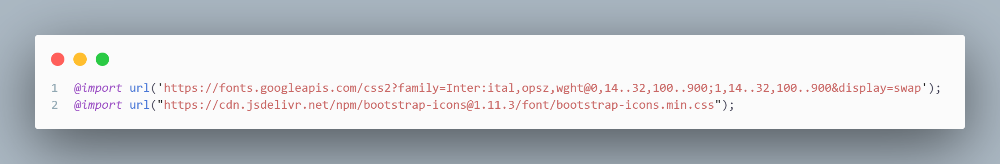

# _**Index.html**_

Aqui no head está guardando elementos importantes como, lang = "pt-br" (idioma que o site é) e configurações padrão do titulo do site, o link separado esta permitindo que eu consiga pegar frameworks do "BootStrap", esse ultimo conjunto de links são os caminhos para o css poder estilizar os conteúdos do HTML.

Esse conjunto inteiro de código é o que forma o cabeçalho do site onde fica armazenado a logo (que está sendo definida pela tag "A") os botoes do menu (que está agrupado por causa de uma lista nao ordena, a tag "UL") e o ícone do perfil do usuário (o ícone do perfil é do bootstrap).

Esse grupo de tag "IMG" é o que esta colocando as imagens do carrossel no site.

Aqui foi usado uma framework importada do bootstrap para definir linhas e colunas mais facilmente através de algumas "DIV" acompanhadas com class para definir a linha e a quantidade de colunas, dentro dessas "DIV" estão a tag "FIGURE" que coloca a imagem e a "FIGCAPTION" acompanhada do "P" que coloca a escrita.

Esse conjunto está criando uma imagem com um titulo e uma descrição que vai ser estilizado dentro do CSS para virar um card. Esse código se repete mais 2 vezes para criar um total de 3 cards no final.

Esse código está criando um formulário que através da tag "FORM" (essa tag que possibilita criar formulários no site) e "INPUT" o fieldset so esta agrupando todos esse elementos (mais por uma boa pratica para evitar erros)

Esta criando um rodapé para o site usando novamente a framework do bootstrap para criar 4 colunas dentro do rodapé, os elementos estão dentro de uma lista nao ordenada. E a tag 
"/BODY " esta fechando o corpo do site

Esse comando é o que esta dando um juntando o código do javascript com o html fazendo funcionar o carrossel.

---
## _**JAVASCRIPT**_

Esse código esta fazendo o carrossel do site funcionar a partir de uma função que se o indexSlide for menor ou igual ao totalSlides, o slide vai ficar passando em um intervalo de 5 segundos.

---
## _**STYLE.CSS**_

O primeiro import está me dando código para poder usar a fonte Inter, ja o segundo import está me possibilitando pegar ícones do bootstrap.

Esta deixando o site sem nenhuma margem, definindo que no site inteiro a fonte padrão vai ser a Inter e a intensidade da cor da letra em 600.

Esta deixando o header e o nav flexível, alinhando os itens ao centro da tela, e a tag "JUSTIFY-CONTENT" está colocando um espaçamento entre os elementos do nav.

Está deixando a fonte sem o sublinhado que fica embaixo da letra, mudando a cor da fonte para #070049, deixando a cor intensidade da cor em 900 e adicionando um comando que ao passar o mouse em cima ele vira um elemento clicável.

Esta mudando o tamanho do ícone do perfil para 23px.

esta deixando o texto sem os elementos de lista que vao na frente, tornando o menu e o avatar flexíveis e colocando um espaçamento de 8px de cada elemento.

Está deixando o texto sem nenhum sublinhado embaixo das escritas, mudando a cor da fonte para #070049, colocando uma borda em volta de cada elemento com 8px e adicionando uma borda arredondada de 8px.

Esses códigos eu tirei do DevTools enquanto eu estava tentando corrigir um erro na hora de alinhar os elementos do cabeçalho, coloquei os valores do primeiro e do segundo código em 0, isso resolveu o problema que tinha acontecido.

Esse condigo esta mudando a cor de letra do menu do cabeçalho e do ícone do perfil do usuário ao passar o mouse em cima.