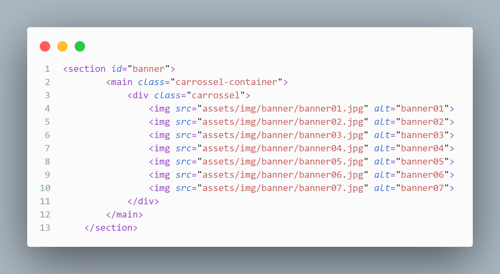

# _**Index.html**_

Aqui no head está guardando elementos importantes como, lang = "pt-br" (idioma que o site é) e configurações padrão do titulo do site, o link separado esta permitindo que eu consiga pegar ícones do "BootStrap", esse ultimo conjunto de links são os caminhos para o css poder estilizar os conteúdos do HTML.

Esse conjunto inteiro de código é o que forma o cabeçalho do site onde fica armazenado a logo (que está sendo definida pela tag "A") os botoes do menu (que está agrupado por causa de uma lista nao ordena, a tag "UL") e o ícone do perfil do usuário (o ícone do perfil é do bootstrap).

Esse grupo de tag "IMG" é o que esta colocando as imagens do carrossel no site.

Aqui foi usado uma framework importada do bootstrap para definir linhas e colunas mais facilmente através de algumas "DIV" acompanhadas com class para definir a linha e a quantidade de colunas, dentro dessas "DIV" estão a tag "FIGURE" que coloca a imagem e a "FIGCAPTION" acompanhada do "P" que coloca a escrita.

