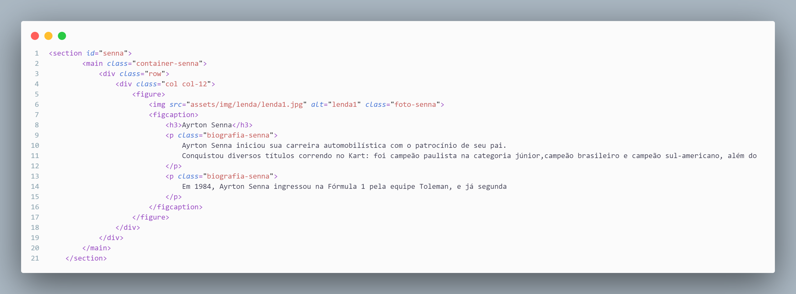

# _**Index.html**_

Aqui no head está guardando elementos importantes como, lang = "pt-br" (idioma que o site é) e configurações padrão do titulo do site, o link separado esta permitindo que eu consiga pegar ícones do "BootStrap", esse ultimo conjunto de links são os caminhos para o css poder estilizar os conteúdos do HTML.

Esse conjunto inteiro de código é o que forma o cabeçalho do site onde fica armazenado a logo (que está sendo definida pela tag "A") os botoes do menu (que está agrupado por causa de uma lista nao ordena, a tag "UL") e o ícone do perfil do usuário (o ícone do perfil é do bootstrap).

Esse grupo de tag "IMG" é o que esta colocando as imagens do carrossel no site.

Aqui foi usado uma framework importada do bootstrap para definir linhas e colunas mais facilmente através de algumas "DIV" acompanhadas com class para definir a linha e a quantidade de colunas, dentro dessas "DIV" estão a tag "FIGURE" que coloca a imagem e a "FIGCAPTION" acompanhada do "P" que coloca a escrita.

Esse conjunto está criando uma imagem com um titulo e uma descrição que vai ser estilizado dentro do CSS para virar um card. Esse código se repete mais 2 vezes para criar um total de 3 cards no final.

Esse código está criando um formulário que através da tag "FORM" (essa tag que possibilita criar formulários no site) e "INPUT" o fieldset so esta agrupando todos esse elementos (mais por uma boa pratica para evitar erros)

Esta criando um rodapé para o site usando novamente a framework do bootstrap para criar 4 colunas dentro do rodapé, os elementos estão dentro de uma lista nao ordenada. E a tag 
"/BODY " esta fechando o corpo do site

Esse comando é o que esta dando um juntando o código do javascript com o html fazendo funcionar o carrossel.

---
## **JAVASCRIPT**

Esse código esta fazendo o carrossel do site funcionar a partir de uma função que se o indexSlide for menor ou igual ao totalSlides, o slide vai ficar passando em um intervalo de 5 segundos